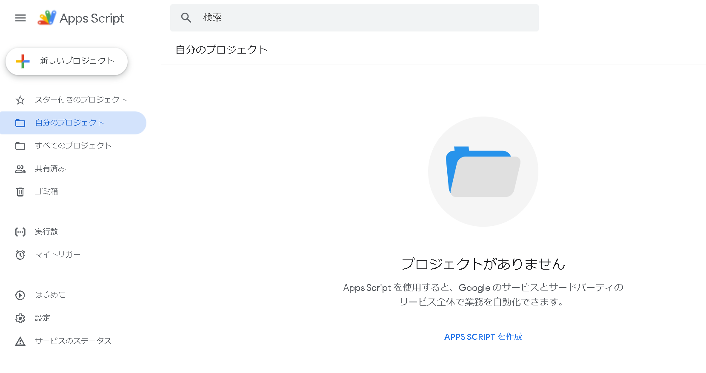
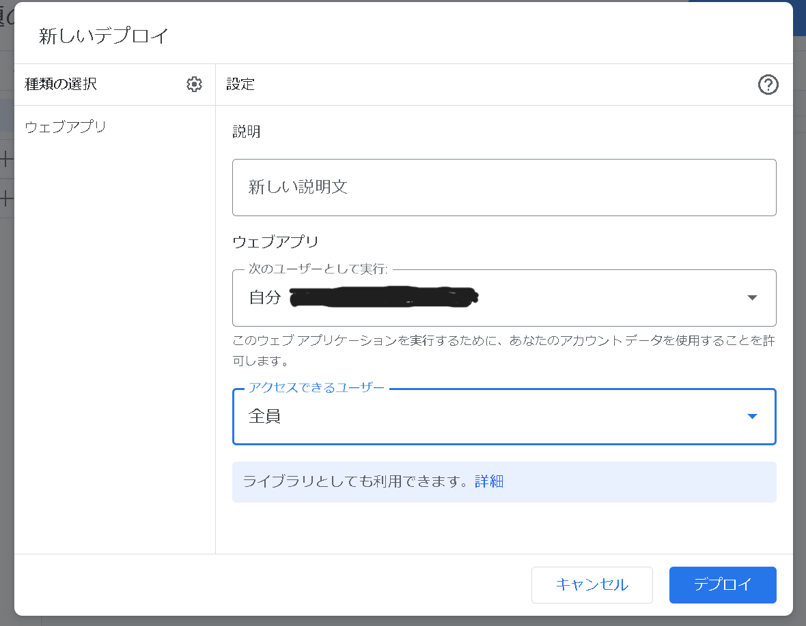

# Google Colablatoryで機械学習モデルの作成

## 準備
- Googleアカウントにアクセスし、[Colablatory](https://colab.research.google.com/)へアクセスする
- Google Colablatoryでは、主にpythonを動かすことができる
- また、この後出てくる[Google App Script](https://script.google.com/)ではJavaScriptを動かすことができる

## Google Drive上へ画像をアップロード
- [参考](https://qiita.com/ichihey/items/8cc1c063790c313df5f8)

### Google App Scriptの準備

- 上のリンクからGoogle App Script管理画面に入り、左上の「新しいプロジェクト」をクリック
- 「コード.gs」に[code.gs](code.gs)を張り付ける

- 右上のデプロイをクリックし、Scriptをデプロイする
  - デプロイの設定は
  - タイプ：ウェブアプリ
  - 次のユーザーとして実行：自分
  - アクセスできるユーザー：全員
- [このページ](https://www2.kobe-u.ac.jp/~tnishida/programming/GAS-01.html)の(4)を参考にScriptを承認する
- デプロイ後に現れる「ウェブアプリ URL」を控えておく

### ESPの準備
- 既製品のカメラ付きESP32もしくは自作のESPカメラにコードを書き込む
  - コードを書き込む際の「myScript」は先ほどコピーしたデプロイアドレスの /macros/ 以降を張り付ける
- 実行すればGoogle Drive上の「ESP32-CAM」フォルダに画像が保存されているはずである

## 機械学習
- 先に作成した画像データを識別したい画像の種類ごとにGoogle Drive上のフォルダにまとめる
- [Colablatory用ジュピターノートブック](Sci_Kit_Learn.ipynb)をGoogle Colablatoryの「ファイル」->「ノートブックをアップロード」からアップロードする
- 三つ目のセルの「labels」と「pathes」を指定のものに置き換えて全てのセルを実行すると学習が終了する
  - 学習モデルはXGBoost法を用いている
- 学習終了後、クラウド上に保存されている「finalized_model.pkl」をローカルにダウンロードする
  - 一度Colablatoryを閉じてしまうとこのデータは失われてしまうのでダウンロードを忘れずに
- ダウンロードした.pklファイルをAWS上のphox-containerのlambda_function.pyで指定した「model_bucket」のバケットにアップロードすれば画像認識用が可能となる