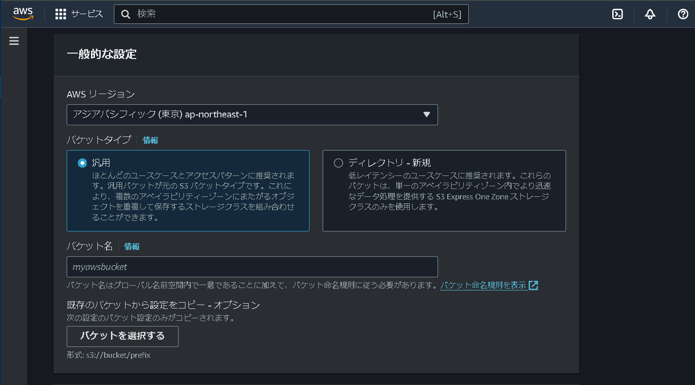
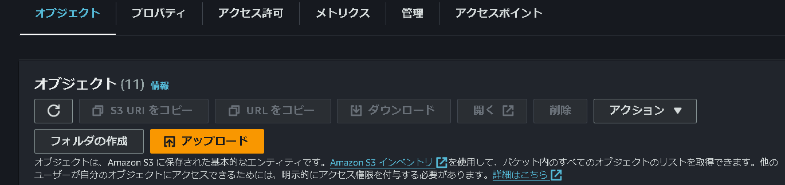

# AWS s3の設定

### バケットの作成
- AWSのコンソールからs3の項目へ入る

- s3のリージョンを設定する
  - なお、このリージョンは任意のリージョンで問題ない
  - よくある話として、サーバー利用料金の安いリージョンにするのが良いという話がある
- バケットタイプ：汎用
- バケット名：任意の名前
  - このバケット名は後で使うことになるので分かりやすい名前が良い
- 残りの項目はデフォルトのままバケットを作成する

### AWS s3利用料金
- s3の利用料金は保存してあるデータ量とその月のアップデート、ダウンロードの回数で決まる
- なんとなくでs3にデータをアップロードしまくったり、ダウンロードしまくると物凄い額が請求されるので注意したい

### データをGUIから操作する

- AWSのコンソールからs3に入り当該のバケットをクリックする
- オレンジ色の「アップロード」をクリックする

- ドラッグ&ドロップまたはファイル選択をする
- アップロード対象のファイルまたはフォルダがブラウザ上で一時的に保存された状態になるので、画面下の「アップロード」ボタンを押してs3にアップロードする