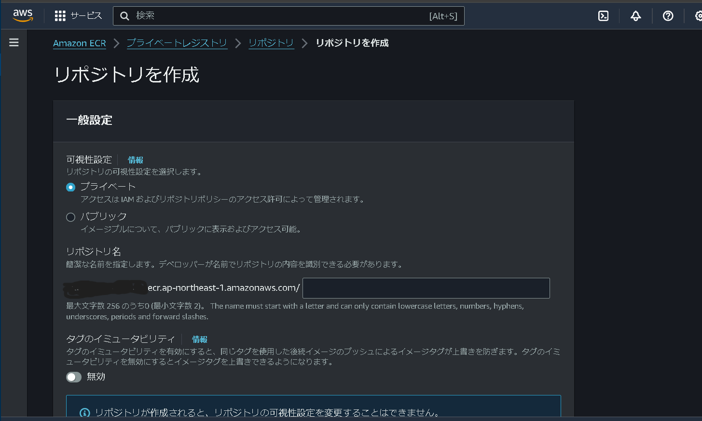
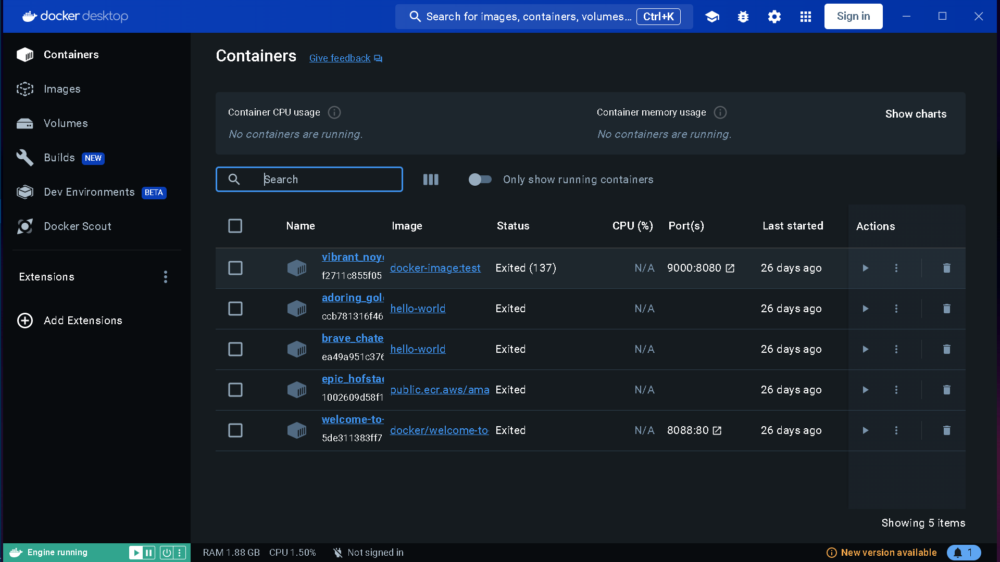
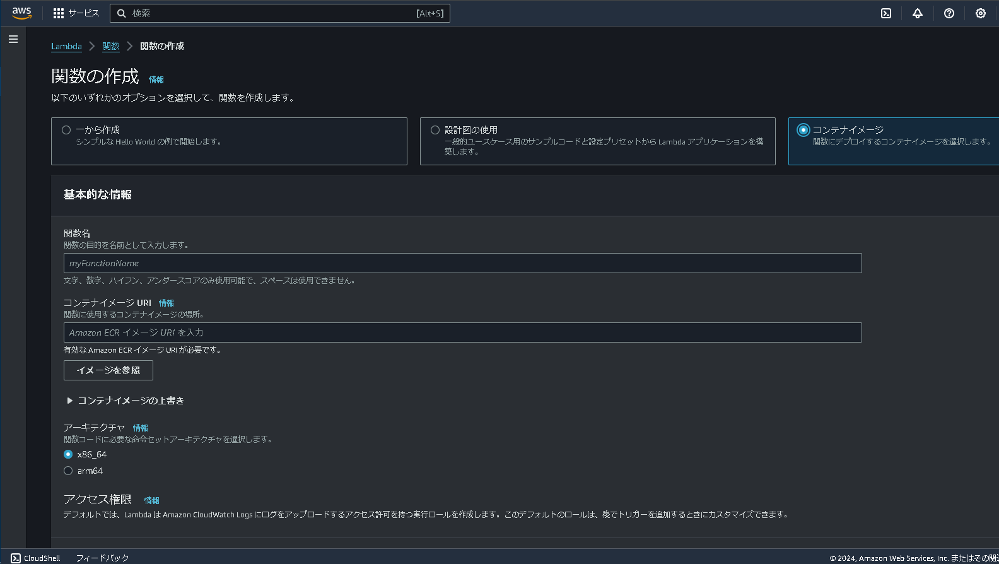

# AWS Elastic Container Registry(ECR)

## 概要
[AWS ECR](https://docs.aws.amazon.com/ja_jp/AmazonECR/latest/userguide/what-is-ecr.html)は、クラウド上にリポジトリを作成することのできるサービスである。

特徴として、リポジトリはgithubのようにストレージとしてのみでなく、クラウド上で実行可能なシステムであるという点である。

ここでは、Docker上で作成したdocker imageをECR上にプッシュしてlambdaを介してサーバーレスで動くシステムを作成する

## 準備

- AWSコンソール上からECRを選択し、新規リポジトリを作成する
- 外部公開しないリポジトリであれば、「プライベート」を選択し、任意のリポジトリ名を入力する
- 「リポジトリを作成」で作成したら完了

## Dockerの準備
### Dockerとは
- Dockerはメインマシンの機種(CPU、OS)に関わらず、任意の環境を対象としたアプリケーションをビルドすることのできるソフトウェアである
- Dockerを使えば、例えばwindows上でビルドしたimageであってもlinux上で動かすことができる

### Dockerのインストール
- [docker for windows](https://docs.docker.com/desktop/install/windows-install/)からインストーラーをダウンロードする
- いつも通りインストールし、dockerを立ち上げる
- サインインしてください、みたいなことを言われることがあるが今回の手順においては必要ないので無視して問題ない


- このような画面が出ればインストールは完了
- なお、dockerでビルドするためにはいつもdockerが起動している必要がある

### AWS CLIのインストール
- AWS CLIはローカルのパソコンからdocker imageをECRにプッシュするためにローカルのパソコンにインストールする
- [AWS CLIダウンロードページ](https://aws.amazon.com/jp/cli/)から環境にあったインストーラーをダウンロードし、インストールする
- インストールが完了したらECRのリポジトリを作成したユーザーに対してアクセスキーを作成する
- [このサイト](https://udemy.benesse.co.jp/development/system/aws-cli.html)を参考にIAMユーザーに対してアクセスキーを発行する
- 次にローカルの環境にawsをリンクさせる
- 次のコマンドをcommand promptもしくはPower Shellで実行する（Windows）
```
aws configure
```
- 先に作成したアクセスキーを当該の場所に入力する
- 必要であればリージョンも指定する
- 次のコマンドを実行し、s3に作成したバケットが見えていれば完了
```
aws s3 ls
```

ここまで来たら準備完了

## docker imageの作成
- Dockerのimageファイルを作成するためのディレクトリを作成する
- 作成したディレクトリに次に示す3つのファイルを作成する
  - Dockerfile
    - Docker上のコマンドラインのようなもの
    - ビルド時には、ここで記述した順に実行されていく
  - requirement.txt
    - python実行時に必要となるライブラリにインストールを指示する
    - "ライブラリ名"=="バージョン"、でインストールすることができる
  - lambda_function.py
    - lambda上で実行するコードを記述したもの
    - リモート上ではこれが実行される
- コマンドライン上で次のコマンドを実行する
```
docker buildx build --platform=linux/arm64  -t docker-image:(任意のイメージ名) --no-cache (先に作成したディレクトリ)
```
- このコマンドで先に作成したDockerfileをもとにimageファイルが作成される
- 「--no-cache」を入れないと、昔ビルドしたキャッシュデータをもとにビルドが行われることがあるので入れることをお勧めする

## docke imageのプッシュ
- ECRに先に作成したdocker imageをプッシュする前に以下のコマンドを実行し、awsにログインする
```
aws ecr get-login-password
aws ecr get-login-password | docker login --username AWS --password-stdin (ECRのリポジトリのURL)
```
- ECRのリポジトリのURLは初めに作成したリポジトリから確認できる
- コマンド実行後「Login Succeeded」が表示されればOK
- 次に、以下のコマンドを実行するとプッシュ完了
```
docker tag docker-image:(任意のイメージ名) (ECRのリポジトリのURL)
docker push (ECRのリポジトリのURL):(イメージタグ)
```
- 始めのtagコマンドで、先のイメージのタグを指定する
- 次のpushコマンドで、ECR上にプッシュする際のECR上でのタグを指定してプッシュしている
  - このタグは初めに指定したタグと同じである必要はない
- ECR上には昔のプッシュがすべて残るので、必要のないバージョンのイメージファイルは削除することを推奨する
  - イメージファイルの数に応じて課金される

## ECRのリポジトリからlambdaを作成

- ここまで作成してきたECRのリポジトリからlambdaを作成する
- lambdaに入り「関数の作成」を選択
- 作成する際の設定は
  - コンテナイメージ
  - URL(ECRのリポジトリのURL)
  - アーキテクチャ：arm64
    - ビルドした際のアーキテクチャに合わせた設定にする
  - 実行ロール：s3へのアクセスとsesへのアクセスが許可されるロールを付与する
- ECRのdocker imageをプッシュし直した際には、lambdaのデプロイも新しいイメージを選択してやり直す必要がある