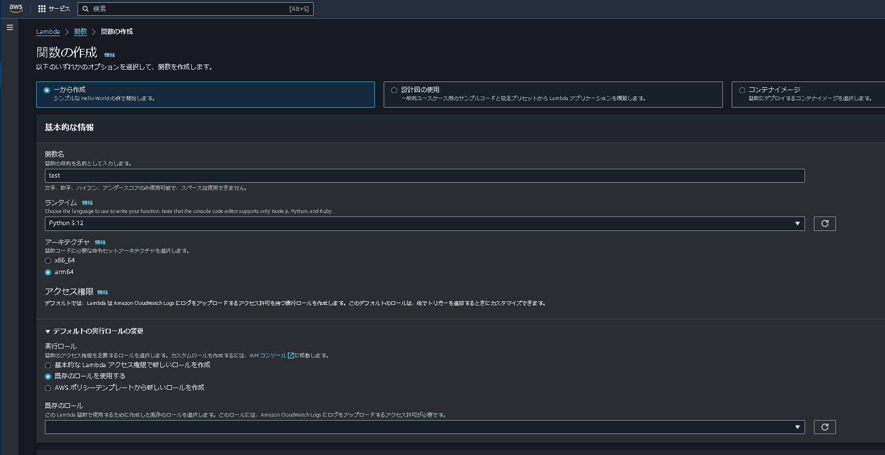

# AWS S3へ画像をアップロード

### lambda関数の作成
- AWSサービスからlambdaを選択
- なお、このときに選んでいるリージョンを確認して、リンクするサービスのリージョンは統一すること


- lambdaの「関数を作成」から関数を作成する
- 各項目ごと
  - 一から作成
  - 任意の関数名
  - ランタイム：Python(バージョンは3以降なら何でもOK)
  - アーキテクチャ：なんでもOK
  - 実行ロール：既存のロールを使用する(あらかじめS3のアクセス権限を与えたロールをアタッチする)
- lambda_function.pyに示すpythonファイルをlambda_function.pyにコピーして貼り付ける
- 右上のデプロイを押してデプロイ(リモート上に保存)する

### lambda関数のテスト
ここではlambda関数のテストとしてGoogle colabolatpryを用いた方法を記す
- encode2base64.pyに示したコードをcolabにコピーして貼り付ける
- コードを実行し、任意の.jpg画像を選択してbase64コードを生成する
- 生成されたコードをコピーして、lambda関数の「テスト」タブの「イベントJSON」に次にように記述してテストを行う
```json
{
  "myjpg":"(コピーしたBase64コード)",
  "position":"(任意の英数字)"
}
```
- テスト実行後、"statusCode":200がログとして出力されればテスト成功である
  - タイムアウトで実行に失敗する場合には「設定」タブの「一般設定」のタイムアウト時間を10秒程度に設定すると解決するかもしれない
- 先のlambdaのコード内で設定したAWS S3のバケットにアクセスすると「image.jpg」と「position.json」が表示されるはずだ
  - 先にも述べたがこのファイルは上記lambdaを実行するたびに上書きされる